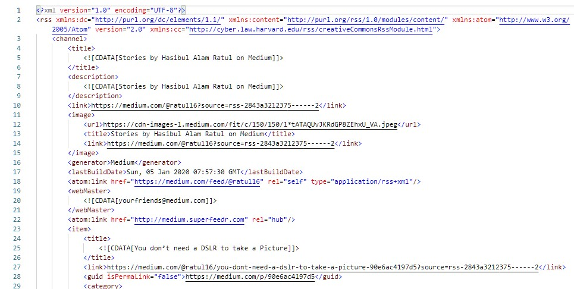
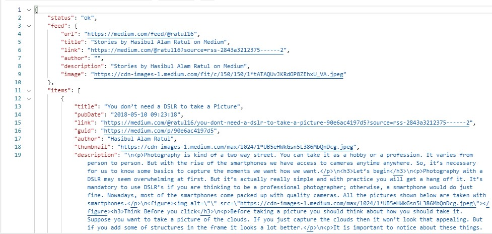

# Medium Api Call

**Medium Api :** " https://medium.com/feed/@USERNAME "

This will return data in XML format which is given below.



But JSON is much easier to work. [RSS2JSON](https://rss2json.com/#rss_url=https%3A%2F%2Fnews.ycombinator.com%2Frss) is a free online Api that will convert the given XML to JSON. And the best part is you can do the whole process at once, you don't have to get the XML first then convert it to JSON.

**Api Url :** " https://api.rss2json.com/v1/api.json?rss_url=https://medium.com/feed/@USERNAME "


The result will be something like this and in JSON format



Now just fetch it and you are done !! 😋😋

```js

fetch('https://api.rss2json.com/v1/api.json?rss_url=https://medium.com/feed/@USERNAME')
  .then((res) => res.json();
  .then((data) => {
    console.log(data);
  });


```

Check out the demo here : https://codepen.io/Jack_Frost/pen/yLypLZE?editors=1010 
